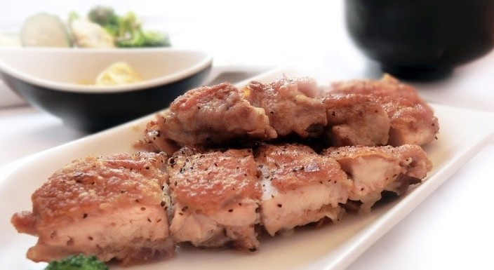
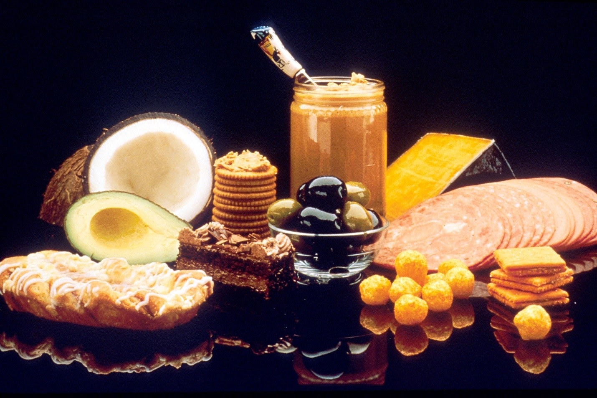
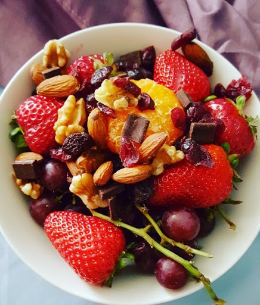

There is no doubt that every woman wants to have a **beautiful body** and be year-round in shape. We all know food plays an **important role** in the weight **loss process**. But when we think that in order to achieve a **weak body** it is necessary to undergo **strict diets** and intense workouts, then our motivation for a nice body quickly evaporates. If that's how you think you're lying. Hunger and deprivation are not the answer to the problem of excess weight.

Whether you are overweight or just want to tighten up slightly and get rid of the few pounds accumulated on holidays or on vacation, remember that starting any diet should be done gradually. That is, it is recommended to phase in healthy and **low-calorie foods** on the menu.

Abrupt changes in diet with a strong decrease in **calorie intake** may work in **the short term,** but do not yield **long-term results** and can even lead to **yo-yo effect**. Long-term fasting slows down our metabolism and does not bring any positive benefits to our body.

**Balanced healthy** eating in **combination with moderate sports** has been shown to lead to more gradual but long-term **guaranteed positive results.**

If you want to finally get into **the desired shape**, only in a **healthy way,** then** follow** our healthy weight loss tips **regularly**

Basic rules for successful and healthy weight loss:

To reduce the kilograms in our body you need to create a caloric deficiency. If we want to lose weight and achieve good results, low-calorie foods must be present in our diet, but they supply all the valuable nutrients our body needs to function properly. That is, it reduces calories to achieve a calorie deficit, but we do not compromise on the nutritional value of products. Only in this way can we achieve weight loss without ruining our metabolism and getting to undesirable conditions such as brittle, nails , hair loss and uncool appearance of the skin and others.

All **semi-finished products**, products containing refined **sugar** and white flour, colours and **preservatives** are completely prohibited. Include a little less in your menu more fresh fruits and **vegetables (multicolored seasonal and green leafy vegetables)**. When we eat what nature has given us, we don't need to count every **calorie** and starve.

When our goal is weight loss, the proteins in our food should overtake the amount of carbohydrates and fats, and fats should naturally be in the least amount. It is important in this case that they come from healthy vegetable sources of fat.

In a healthy diet for weight loss is present:

**50%** high quality protein: chicken, turkey, veal, fish, eggs, low-fat cottage cheese, legumes (lentils, beans), various types of fish (mackerel, trout, salmon)

**15% **healthy fats: olive oil, raw nuts, seeds, avocado, vegetable oils, fish and peanut butter

**35%** slow-digestible carbohydrates: **potatoes, rice, oats, corn, pulses such as quinoa, buckwheat, amaranth.**

**Carbohydrates** of this type are slowly broken down by the body, maintaining the city for long as they do not sharply increase the level of insulin, as opposed to fast-absorption carbohydrates, which are contained in non-healthy foods.

**"Eat like a beggar at dinner"**

Avoid hearty meals in the evening. Then there is the time to skip the carbohydrates, as our body prepares for sleep and there is no need for this extra energy. Calories from accepted carbohydrates and sugars will not be consumed in the evening and they will be stored in the form of body fat.

It is good to take most of the carbohydrates for the day of** breakfast**, when our body needs the most energy, and our dinner to be light and poor in carbohydrates, with more attention paid to vegetables. Fruit intake is recommended to be at breakfast as they also contain sugars that we need more in the first part of the day.

Prepare your food at home

Cooking at home is the surest way to know** 100%** what's in our **food**. Yes, it takes longer than buying it, but it is most useful for our body. Often ready-made **"healthy" foods** in the shop network such as packaged salads, ready-made dressings, sandwiches and muesli are not so healthy at all.

You just need to look at the label to find out about the preservatives they contain and make sure of the marketing tricks they fool us with every day. There are a number of foods on the market that are labeled healthy, but are actually quite caloric and contain sugar and preservatives. These are, for example, fruit juices, fruit milks.

Avoid also using sauces such as ketchup, mustard and mayonnaise, as well as various dressings. Do your **salad dressing** only at **home.**

Read all labels

Having mentioned labels, this is one of the things that you should not pass by if you really want to get a nice body. Not to mention the fact that some **manufacturers **even fail to mention some **ingredients **on the label, so choosing foods as close to nature as possible will guarantee us a quick result of the diet.

#**Sample diet for weight loss**

**The diet is** followed indefinitely, depending on your weight and type of metabolism. It is important to note that with each result come at different speeds , so arm yourself with patience.

It is very important not to give up and not despair if you "sin" at some point with an unhealthy temptation. Then just continue with the diet. The fact is that when we occasionally** enjoy favorite foods **in moderation, so we are actually more likely to adhere to the given** healthy diet** for longer.

The given diet is estimated at **2,250 calories** and is recommended for overweight people. We can skip some days and move on to the next day or we can repeat a day.

**coffee** and tea are drunk without sugar, we can sweeten them with a spoonful of **honey**

salads are seasoned with homemade dressing: one sup. a liar. olive oil and vinegar, salt to taste

it is recommended to drink about one glass of water before each meal to boost metabolism

we can skip the intermediate meal after breakfast if we do not feel hunger

as an intermediate meal we can choose natural yogurt with blueberries (or other berries)

#Day 1:

###**Breakfast**

One grapefruit, two poached eggs or fried without fat, two slices of toasted whole grain bread, one cup of low-fat milk, one cup of black coffee or herbal tea

Intermediate breakfast (optional)

A bowl of yogurt with two soups. scoops of honey

#**Lunches**

**170 roasted** chicken breasts, tomato salad, onions, croutons and homemade dressing

Intermediate breakfast

Strips of raw carrot, 3 sup. scoops of hummus, half whole grain tortilla

###**Dinner**

Steamed broccoli, about 113 g. fish, salad with spinach leaves, tomato and onions, a glass of white wine or sparkling water with a slice of lemon

#**Day 2:**

###**Breakfast**

Whole Grain muffin, 2 sup.k.p. peanut butter, 1 orange, a cup of low-fat milk, a cup of black coffee or herbal tea

###**Lunches**

Turkey sandwich (170g turkey, slice tomato, green lettuce and natural mustard, two slices of wholemeal bread), a bowl of vegetable soup.

Intermediate breakfast

Bowl of grapes

###**Dinner**

140 g steak of beef fillet, steamed spinach, green beans, carbonated water with lemon

#**Day 3:**

###**Breakfast**

oat muffin, orange, cup of low-fat milk, a cup of black coffee or herbal tea

Intermediate breakfast

Pear, a glass of soy milk

###**Lunches**

Chicken soup with noodles, 6 wholegrain crackers, 1 medium apple

Intermediate breakfast

Apple and sparkling water with lemon

###**Dinner**

226g turkey, boiled beans, carrot, raw kale, glass of wine

#**Day 4:**

###**Breakfast**

A bowl of oatmeal with a glass of low-fat milk, whole grain bread with soup. a liar. peanut butter, a cup of black coffee or herbal tea

Intermediate breakfast

One tangerine and a bowl of grapes

###**Lunches**

Whole Grain tortilla with lettuce, tomato slice, avocado slice

Intermediate breakfast

Low-fat cottage cheese, slices of fresh pineapple

###**Dinner**

Lasagna with whole grain crusts, salad with tomatoes and onions, a glass of low-fat milk

###**Day 5:**

###**Breakfast**

Whole Grain slice of bread with 1 sup. a liar. maple syrup, poached eggs, turkey fillet, a glass of orange juice, a cup of black coffee or herbal tea

###**Lunches**

Vegetable burger with wholegrain bread and beans, a glass of low-fat milk

Intermediate breakfast

Apple with whole grain tortilla and 2 sup. a liar. Humus

###**Dinner**

Roasted trout, green beans, garden salad, carbonated water with lemon

#**Day 6:**

###**Breakfast**

Bowl of oatmeal with low-fat milk, banana, 1 boiled egg, black coffee or herbal tea

###**Lunches**

Whole Grain pasta with tomato sauce, tomato salad

Intermediate breakfast

Yoghurt with 1 sup.false. honey, blueberries, 1 sup. a liar. almond flakes

###**Dinner**

140g chicken fillet, tomato, onion and asparagus salad, glass of wine or sparkling water with lemon

#**Day 7:**

###**Breakfast**

Bowl of oatmeal with blueberries, 1 sup. a liar. almond flakes, 2 slices of bacon guns, a glass of low-fat milk

###**Lunches**

170g chicken breast, 1 baked sweet potato, whole grain bread

###**Intermediate breakfast**

Rose broccoli, carrot strips, pear, two soups. a liar. vegetable dip

###**Dinner**

85g grilled salmon, coarse beans, coleslaw, sparkling water with lemon
