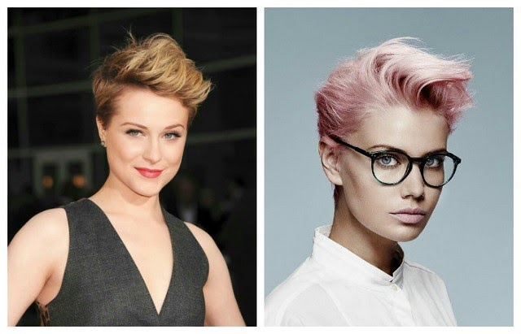
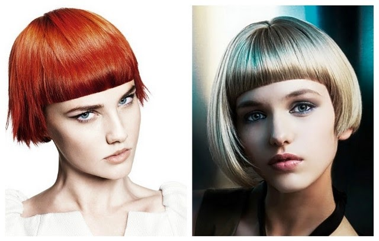

The best way to change your appearance is to sit on the chair of the hairdresser, and make a new stylish hairstyle. For those looking for change this is a great way to get it and change its image with short hair season 2021, photos and names hairstyles for short hair can be seen in this article.Today stylists offer a wide variety of variants of hairstyles for short hair, which can surprise you, fascinate you and make you feel like a real goddess.

Women's short hairstyles in this season will be fashionable and stylish. You can try something new in short haircuts. You will not notice how the hair will make you feel free and light. And so the change will begin. Self-esteem and confidence will shine through you.

After all, the properly selected short hairstyle together with your stylist for the 2021 season will give you more confidence. If you don't like it, or just don't have time to keep an eye out for your hair appearance, it will save you time and you'll always look flawless and stylish..

To make sure that the short women's hairstyles 2021 year are no less stylish than long hair, we will offer you to see photos of the most beautiful female hairstyles 2021 and walk through the most fashionable trends for hairstyles for short hair. Moreover, it should be remembered that the short hairstyle rejuvenates and makes the face more refined and beautiful, emphasizing its best features.

The most fashionable hairstyles for short hair season 2021 In the new season stylists pay special attention to the hairstyle called pixie, which has the most options for styling short hair. Moreover, short hair pixie are the most diverse, so they are suitable for young girls and for women, say, more middle-aged. Among the many examples are a good option and pixie hairstyles for short hair for any woman who wants to transform.

Let this be a classic short hairstyle pixie or short hairstyle pixie, Pixie with direct or long bangs, asymmetric hairstyles "pixie", and even a short hairstyle in the style of pixie with Brittany. As you can see, to experiment something, really, for all models hairstyles for short hair in pixie style looks very impressive and interesting.

In addition, short hair pixie, you have the opportunity to change your hairstyle to suit your mood. Depending on the chosen option hairstyles, short hair can be different. He lies on his back, on the one hand, in retro style with Hollywood waves. And this is not the whole list of short hairstyles that you can do with pixie. The more ideas you can find in our collection from the photo below.

Short plaid to become a classic

In the new season it will be a fashion equal plaid without asymmetry. Clear and slightly sharp edge of the hair hairstyle plaid at the level of the cheekbones perfectly models the oval of the face, which gives it sophistication.

Very beautiful looks plaid on short curly hair. By the way, the light duvet is back in vogue. So, if you want to become the owner of a short plaid boldly choose the shape for curly hair.

Curls, braids, bun – all this can be done with a short plaid of hair.

** Hairstyles for short female "hat" and "under sweat" again on the go**

Quite extravagant, but at the same time is a very stylish hairstyle for short hair "hat" which takes its place among the most fashionable hairstyles 2021.

If you have straight and thick hair, this is this short hairstyle suitable for you. But there is another important point in choosing short hair to comply with the shape of the face. According to stylists, it is best for it to look like a hair cut for the oval and triangular type.

– Popular short haircuts for women Bob and Bob-Bob

Do not lose their popularity in 2021, known to very short women's hairstyles type beans and bean-on-plaid. Although, as we see, compared to the previous season, the search for such hairstyles for short hair has numerous options that fall within the range of the type of face, the structure of the hair and its style.

This hairstyle is universal and it will allow you to satisfy even the most demanding people for beauty, regardless of age. Hairstyles, in turn, look simple, and are suitable for older women and many young girls.

**Creative short women's hairstyles**

A truly unique and interesting hairstyle can be made by specialists with the help of a clipper with which they work in the stylish execution of a hairstyle for short hair. Ideas for hairstyles for short hair will give you only reputable salons with proven professionalism on the part of stylists. A beautiful and original pattern can appear in the neck area. He even shaved part of the bangs on his forehead.

